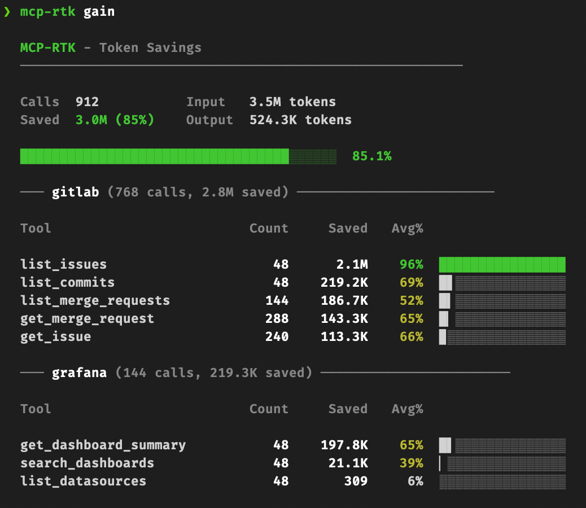

<div align="center">

```
  ███╗   ███╗ ██████╗██████╗       ██████╗ ████████╗██╗  ██╗
  ████╗ ████║██╔════╝██╔══██╗      ██╔══██╗╚══██╔══╝██║ ██╔╝
  ██╔████╔██║██║     ██████╔╝█████╗██████╔╝   ██║   █████╔╝
  ██║╚██╔╝██║██║     ██╔═══╝ ╚════╝██╔══██╗   ██║   ██╔═██╗
  ██║ ╚═╝ ██║╚██████╗██║           ██║  ██║   ██║   ██║  ██╗
  ╚═╝     ╚═╝ ╚═════╝╚═╝           ╚═╝  ╚═╝   ╚═╝   ╚═╝  ╚═╝
```

# mcp-rtk

[](https://crates.io/crates/mcp-rtk)
[](https://gitlab.com/thomastartrau/mcp-rtk/-/pipelines)
[](LICENSE)

**MCP proxy that cuts 60-90% of tokens from tool responses**

*Drop it in front of any MCP server. Same tools, way fewer tokens.*

[Quick start](#quick-start) •
[Presets](#presets) •
[Commands](#commands) •
[Configuration](#configuration) •
[Contributing presets](#contributing-a-preset)

</div>

---

## The problem

MCP servers return raw API responses. A single `list_issues` call from GitLab can dump 180K+ tokens of JSON into your context: full user objects with avatar URLs, null fields everywhere, nested metadata nobody asked for. You pay for all of it.

## What mcp-rtk does

It sits between Claude and your MCP server as a transparent proxy. Tool calls go through unchanged, but responses get compressed through an 8-stage filter pipeline before they hit your context window.

```
Claude ←(stdio)→ mcp-rtk ←(stdio)→ upstream MCP server
```

The LLM gets the same information in a fraction of the tokens.

<p align="center">
  
</p>

## Install

```bash
cargo install mcp-rtk
```

## Quick start

Wrap your existing MCP server command with `mcp-rtk --`. One line change in your Claude Code config.

**Before** (`~/.claude.json`):
```json
{
  "mcpServers": {
    "gitlab": {
      "command": "npx",
      "args": ["-y", "@nicepkg/gitlab-mcp"],
      "env": { "GITLAB_PERSONAL_ACCESS_TOKEN": "glpat-..." }
    }
  }
}
```

**After**:
```json
{
  "mcpServers": {
    "gitlab": {
      "command": "mcp-rtk",
      "args": ["--", "npx", "-y", "@nicepkg/gitlab-mcp"],
      "env": { "GITLAB_PERSONAL_ACCESS_TOKEN": "glpat-..." }
    }
  }
}
```

mcp-rtk detects the upstream server from the command and loads the matching preset automatically.

## Filter pipeline

Every response passes through 8 stages, in order:

| Stage | Effect |
|-------|--------|
| `keep_fields` | Whitelist: only retain specified fields |
| `strip_fields` | Blacklist: recursively remove fields like `avatar_url`, `_links` |
| `condense_users` | `{id, name, username, avatar_url, ...}` becomes `"username"` |
| `strip_nulls` | Drop all `null` and empty string values |
| `flatten` | `{"data": [...]}` becomes `[...]` |
| `truncate_strings` | Cap long strings (descriptions, diffs) at N chars |
| `collapse_arrays` | Keep first N items, append `"... and X more"` |
| `custom_transforms` | Regex-based string replacements |

Even without a preset, generic defaults apply: null stripping, user condensing, flattening, and field removal. This alone typically saves 30-40%.

## Presets

Presets are TOML files with tool-specific filter rules. mcp-rtk ships with community-maintained presets and auto-detects which one to use based on the upstream command.

| Preset | Detected from | Tools covered |
|--------|--------------|---------------|
| `gitlab` | `gitlab-mcp`, `gitlab` | 45+ tools across MRs, issues, pipelines, commits, projects, labels, releases |
| `grafana` | `mcp-grafana`, `grafana` | 15+ tools for dashboards, datasources, Prometheus, Loki |

You can force a specific preset:

```bash
mcp-rtk --preset gitlab -- node my-custom-gitlab-server.js
```

### What a preset looks like

Each preset defines per-tool rules that get merged on top of the generic defaults. Here's an excerpt from the GitLab preset:

```toml
[tools.list_merge_requests]
keep_fields = ["iid", "title", "state", "author", "source_branch", "target_branch", "web_url"]
max_array_items = 20
condense_users = true

[tools.get_merge_request_diffs]
keep_fields = ["old_path", "new_path", "diff", "new_file", "deleted_file"]
truncate_strings_at = 2000
max_array_items = 50

[tools.list_issues]
keep_fields = ["iid", "title", "state", "author", "labels", "assignees", "web_url"]
max_array_items = 20
condense_users = true
```

The full GitLab preset covers merge requests, pipelines, jobs, issues, commits, files, projects, members, labels, releases, and events.

### Creating your own preset

If you use an MCP server that doesn't have a built-in preset, you can write your own as a TOML config:

```toml
# ~/.config/mcp-rtk/my-server.toml

[filters.default]
strip_nulls = true
condense_users = true
truncate_strings_at = 800
max_array_items = 25
strip_fields = ["avatar_url", "_links", "metadata"]
flatten = true

[filters.tools.list_items]
keep_fields = ["id", "name", "status", "created_at"]
max_array_items = 15

[filters.tools."get_*"]        # glob pattern — matches all get_ tools
truncate_strings_at = 1500
strip_fields = ["internal_id", "legacy_data"]
```

Then pass it with `--config`:

```bash
mcp-rtk --config ~/.config/mcp-rtk/my-server.toml -- your-mcp-server
```

### Contributing a preset

Found good filter rules for an MCP server you use? Submit a preset so others can benefit too.

1. Create a TOML file in `config/presets/` named after the server (e.g., `github.toml`)
2. Add your tool-specific filter rules (look at `gitlab.toml` or `grafana.toml` for reference)
3. Register it in `src/config.rs` in the `PRESETS` array with detection keywords
4. Open a merge request

The more MCP servers get presets, the more tokens everyone saves.

## Configuration

For power users who want to tweak filter behavior beyond what presets provide.

```bash
mcp-rtk --config ~/.config/mcp-rtk/custom.toml -- npx @nicepkg/gitlab-mcp
```

```toml
[filters.default]
strip_nulls = true
condense_users = true
truncate_strings_at = 500
max_array_items = 20
strip_fields = ["avatar_url", "_links", "time_stats"]
flatten = true
custom_transforms = [
  { pattern = "https://gitlab\\.com/[^ ]+", replacement = "[link]" }
]

[filters.tools.get_merge_request_diffs]
truncate_strings_at = 2000

[filters.tools.list_merge_requests]
keep_fields = ["iid", "title", "state", "author", "source_branch", "target_branch"]
max_array_items = 15

[tracking]
enabled = true
db_path = "~/.local/share/mcp-rtk/metrics.db"
```

User config overrides preset rules. Tool-specific `strip_fields` and `custom_transforms` are concatenated with defaults, everything else replaces them.

Tool names support glob patterns: `*` matches any sequence, `?` matches a single character. Exact matches always take priority over patterns.

## Commands

### `mcp-rtk gain`

See how many tokens you've saved.

```bash
mcp-rtk gain                # summary with per-tool breakdown
mcp-rtk gain --history      # last 50 calls with individual details
mcp-rtk gain --export json  # machine-readable JSON output for scripting
```

### `mcp-rtk discover`

Scan your Claude Code session logs to find MCP servers that aren't proxied yet and estimate how many tokens you could save.

```bash
mcp-rtk discover            # last 30 days
mcp-rtk discover --days 7   # last week
```

### `mcp-rtk install`

Automatically wrap MCP servers in a config file with mcp-rtk. Scans for stdio servers and rewrites their command/args.

```bash
mcp-rtk install .mcp.json                    # wrap all stdio servers
mcp-rtk install .mcp.json --server gitlab    # wrap only the "gitlab" server
```

### `mcp-rtk uninstall`

Remove mcp-rtk wrapping from MCP servers in a config file.

```bash
mcp-rtk uninstall .mcp.json                    # unwrap all servers
mcp-rtk uninstall .mcp.json --server gitlab    # unwrap only "gitlab"
```

### `mcp-rtk presets`

Browse, create, and fetch presets.

```bash
mcp-rtk presets list          # show all available presets
mcp-rtk presets show gitlab   # print the full TOML for a preset
mcp-rtk presets init          # interactive preset scaffolding
mcp-rtk presets init -o my.toml
mcp-rtk presets pull https://example.com/preset.toml   # fetch a community preset
mcp-rtk presets pull https://example.com/preset.toml -o custom.toml
```

### `mcp-rtk validate-preset`

Check a preset or config file for syntax errors and potential issues before using it.

```bash
mcp-rtk validate-preset my-preset.toml
```

### `mcp-rtk dry-run`

Test filters on JSON from stdin without running a proxy. Stats go to stderr, filtered JSON to stdout.

```bash
echo '{"id":1,"title":"test","avatar_url":"...","_links":{}}' | mcp-rtk dry-run --preset gitlab --tool list_issues
cat response.json | mcp-rtk dry-run --config custom.toml --tool get_merge_request
```

### `mcp-rtk diff`

Show a colored side-by-side diff between raw and filtered JSON. Reads from stdin.

```bash
cat response.json | mcp-rtk diff --preset gitlab --tool list_merge_requests
cat response.json | mcp-rtk diff --config custom.toml --tool get_merge_request
```

## Safety

Responses are filtered, never blocked. A few guardrails keep things predictable:

- 10 MB response cap: oversized responses get truncated before parsing
- 128-level recursion limit, matching serde_json's default
- String truncation respects UTF-8 character boundaries
- Non-JSON responses pass through with only string truncation applied
- Images and resources are forwarded unchanged

## License

[MIT](LICENSE)
